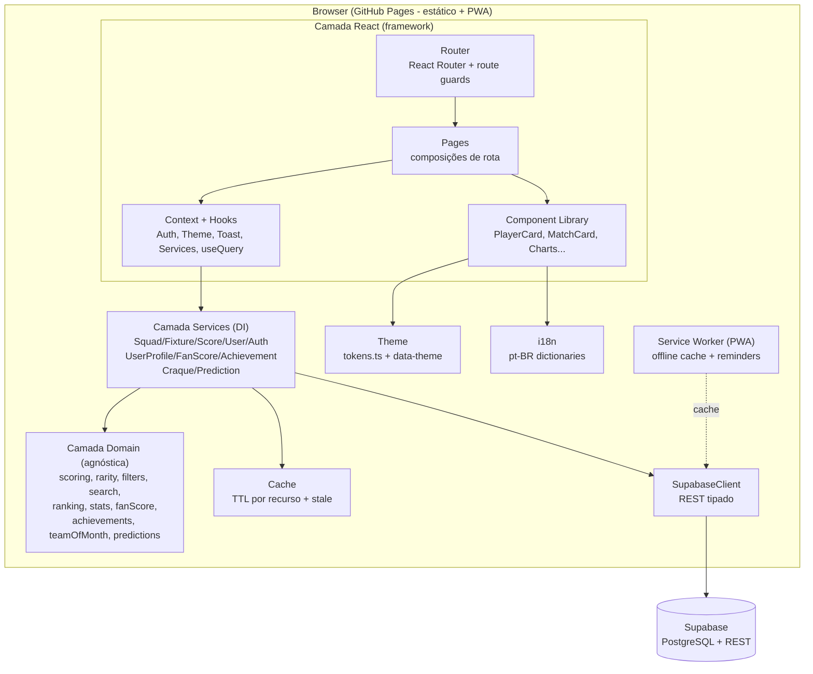
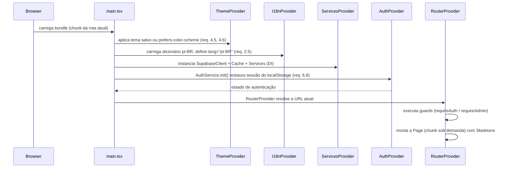
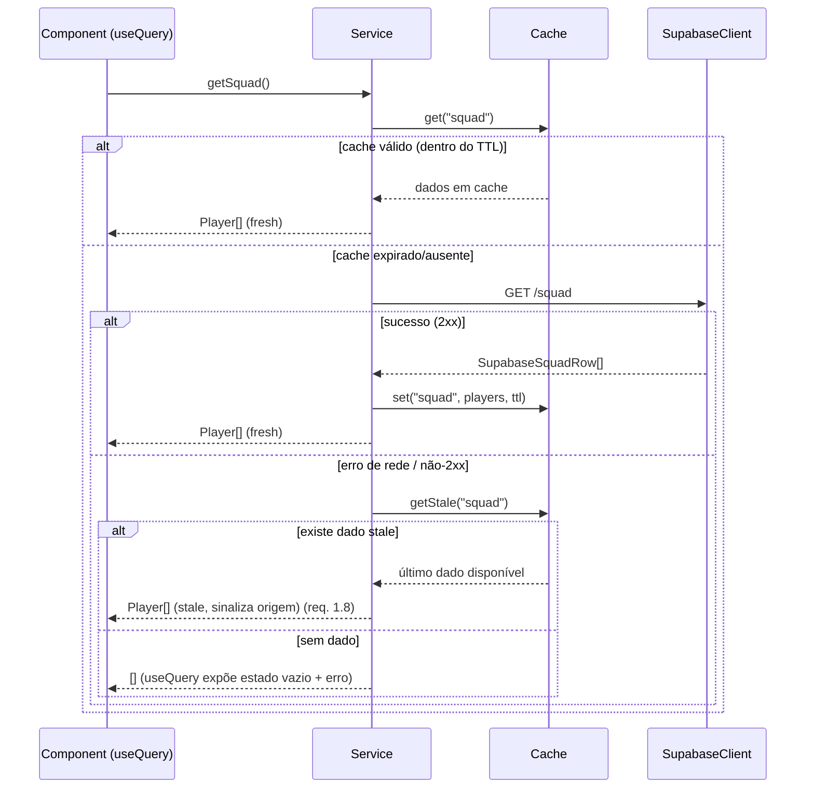
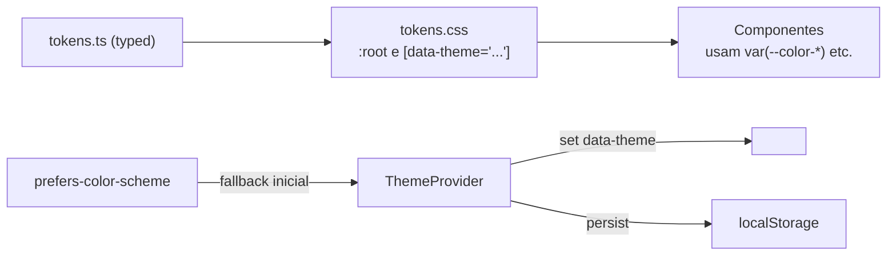

# Documento de Design — JeanScore 2.0

## Overview

O JeanScore 2.0 transforma a aplicação atual (JavaScript vanilla com objetos globais `CONFIG`, `SUPA`, `API`, `AUTH`, `APP` carregados via `<script>`, além do legado de Google Sheets) em um **produto digital de futebol premium** construído sobre **React + TypeScript estrito + Vite**. A camada de interface passa a ser uma árvore de componentes React reutilizáveis, roteada por **React Router** com route guards parametrizáveis; a lógica de negócio permanece isolada em uma camada de **Domínio agnóstica de framework**, alvo ideal de testes baseados em propriedades.

O design preserva os pilares que já funcionam — o modelo de dados no Supabase (`users`, `squad`, `fixtures`, `escalacoes`, `game_scores`, `permanent_scores`), a autenticação com aprovação manual e hash SHA-256, as cartas estilo Ultimate Team e a votação por partida — e reorganiza tudo em camadas testáveis e componíveis. Sobre essa base, adiciona as novas dimensões de produto descritas em `VISION.md`: Perfil do Usuário, Fan Score e Níveis de Torcedor, Conquistas, Time da Comunidade do Mês, Comparação de Jogadores, Coleções, Craque da Partida, Palpites pré-jogo, temas, i18n, PWA com lembretes e onboarding.

Toda a linguagem visual deriva exclusivamente do `DESIGN_SYSTEM.md`: componentes nunca referenciam valores literais de cor, espaçamento, raio, sombra ou duração — apenas Design_Tokens. Toda string de UI é resolvida por Chave_i18n (chaves em inglês → textos em português do Brasil).

A migração **remove por completo** o legado do Google Sheets (`js/sheets.js`, `google-apps-script/Code.gs`) e os scripts globais em `js/`, consolidando o acesso a dados no `SupabaseClient` tipado e injetado.

### Regra de Idioma (aplicada ao produto)

- **Inglês (técnico):** todos os identificadores deste documento — camadas, componentes, funções, tipos, tabelas, pastas e arquivos.
- **Português do Brasil (UI):** todas as strings visíveis, sempre via Chave_i18n; nenhum texto de UI hardcoded dentro de componentes.

### Princípios de Design

1. **Futebol primeiro, componível por padrão.** Páginas são composições de componentes reutilizáveis da biblioteca; nenhum novo elemento visual nasce dentro de uma página (component-first, req. 3.5).
2. **Domínio puro e testável.** Scoring, raridade, filtros, busca, ranking, estatísticas, Fan_Score, Conquistas, Time do Mês e Palpites são funções puras em `src/domain/`, sem React, DOM ou rede (req. 1.2).
3. **Injeção de dependências.** Services recebem `SupabaseClient` e `Cache` pelo construtor, permitindo mocks em teste sem tocar na UI (req. 1.5, 5.4).
4. **Temável e internacionalizável desde a base.** Tokens via CSS Custom Properties + `data-theme`; strings via i18n (req. 2, 4).
5. **Extensibilidade sem refatoração.** Interfaces de domínio extensíveis, `AuthService` substituível, guards parametrizáveis (`requireAuth`, `requireAdmin`, futuro `requirePremium`) (req. 5).
6. **Degradação graciosa.** Falhas de rede caem no Cache mais recente (stale fallback); carregamento usa Skeletons; estados vazios e 404 são explícitos (req. 1.8).

### Decisões Técnicas Principais

| Decisão | Escolha | Justificativa |
|---------|---------|---------------|
| Linguagem | TypeScript `strict: true` | Tipagem de entidades e respostas do Supabase (req. 1.1) |
| UI | **React 18** (function components + hooks) | Arquitetura orientada a componentes reutilizáveis (req. 1.1, 3) |
| Bundler | **Vite** | Build estático para GitHub Pages, code splitting por rota (req. 1.10, 32.7) |
| Roteamento | **React Router** (`createBrowserRouter`) | Guards parametrizáveis, rotas com parâmetros, histórico nativo (req. 1.4, 5.2, 12) |
| Estado global | **React Context** (Auth, Theme, Toast, Services) + hooks | Estado transversal leve, sem store pesado (req. 2, 4, 31) |
| Data fetching | Hook `useQuery` próprio sobre Services + Cache | Reaproveita DI e stale fallback existentes (req. 1.7, 1.8, 32.3) |
| Gráficos | **Recharts** (wrapper React sobre SVG) | LineChart, Histogram (BarChart) e RadarChart com sobreposição; leve e temável por tokens (req. 29) |
| Temas | Design_Tokens (CSS vars) + `tokens.ts` tipado + `data-theme` | Troca de tema sem tocar componentes (req. 4) |
| i18n | Dicionários `en`→`pt-BR` + hook `useI18n` | Regra de duas línguas garantida pela arquitetura (req. 2) |
| PWA | `vite-plugin-pwa` (manifest + service worker Workbox) | Instalável, cache offline, lembretes (req. 34) |
| Testes | **Vitest + fast-check** | Vitest integra com Vite; fast-check para property-based testing (req. 1.9) |
| Backend | Supabase REST | Reaproveita schema e dados; novas tabelas seguem o mesmo padrão |

---

## Architecture

### Visão em Camadas (React)



**Regra de dependência:** as setas apontam sempre da camada externa para a interna. A camada `domain` importa apenas de `types` — nunca de `react`, `services`, `router`, `components` ou `pages`. Isso garante que a lógica de negócio seja testável isoladamente (req. 1.2, 5.4) e mantém o Domínio 100% agnóstico de framework.

### Estrutura de Diretórios

```
src/
  main.tsx                # bootstrap React: providers + RouterProvider
  App.tsx                 # composição raiz de Providers e layout
  types/                  # interfaces e tipos (sem lógica)
    domain.ts             # Player, Fixture, GameScore, UserProfile, Achievement, ...
    supabase.ts           # tipos de linha crua (SupabaseXxxRow)
    index.ts
  domain/                 # LÓGICA PURA, agnóstica de framework
    rarity.ts             # calcRarity, mapScoreToRating
    scoring.ts            # normalizeScore, calcAverage, calcStdDev
    ranking.ts            # buildRankings (todas as categorias)
    filters.ts            # filterByPosition, filterCombined, sortPlayers
    search.ts             # normalizeText, search (sem acento/caixa)
    stats.ts              # histograma, evolução, tendências, forças/fraquezas
    serialization.ts      # (de)serialização e mapeamento Supabase<->domínio
    fanScore.ts           # applyFanScore, fanLevel, levelIndex, progressToNext
    achievements.ts       # evaluateAchievements (data-driven, idempotente)
    teamOfMonth.ts        # buildTeamOfMonth (position-aware)
    predictions.ts        # scorePrediction (palpites)
  services/               # ACESSO A DADOS (DI: SupabaseClient + Cache)
    supabase-client.ts
    cache.ts
    squad.service.ts
    fixture.service.ts
    score.service.ts
    user.service.ts
    auth.service.ts
    user-profile.service.ts
    fan-score.service.ts
    achievement.service.ts
    craque.service.ts
    prediction.service.ts
  components/             # BIBLIOTECA DE COMPONENTES (temável, i18n)
    cards/                # PlayerCard(FifaCard), MatchCard, RankingCard,
                          # CollectionCard, AchievementCard, StatCard
    charts/               # LineChart, Histogram, RadarChart
    layout/               # HeroSection, Navigation, PlayerHeader, Podium
    feedback/             # Toast, Modal, Skeleton, EmptyState, Countdown
    controls/             # Button, Badge, CompetitionBadge, SearchPanel,
                          # StatisticsPanel
  pages/                  # COMPOSIÇÕES DE ROTA
    HomePage.tsx  ElencoPage.tsx  PlayerProfilePage.tsx  CompararPage.tsx
    JogosPage.tsx  MatchDetailPage.tsx  RankingsPage.tsx  TimeDoMesPage.tsx
    ColecoesPage.tsx  PerfilPage.tsx  AvaliarPage.tsx  AdminPage.tsx
    OnboardingPage.tsx  NotFoundPage.tsx
  router/                 # NAVEGAÇÃO
    routes.tsx            # tabela de rotas
    guards.ts             # requireAuth, requireAdmin, requirePremium (futuro)
    ProtectedRoute.tsx    # componente que aplica guards
  theme/                  # DESIGN TOKENS + TEMAS
    tokens.ts             # tokens tipados (fonte da verdade em TS)
    tokens.css            # CSS Custom Properties por [data-theme]
    ThemeProvider.tsx     # aplica/persiste tema; prefers-color-scheme
  i18n/                   # INTERNACIONALIZAÇÃO
    keys.ts               # tipo I18nKey (chaves em inglês)
    pt-BR.ts              # dicionário pt-BR
    I18nProvider.tsx      # provider + hook useI18n
  hooks/                  # HOOKS REUTILIZÁVEIS
    useQuery.ts           # data fetching sobre Services + Cache (stale fallback)
    useCountdown.ts  useDebounce.ts  useMediaQuery.ts  useReducedMotion.ts
  context/                # CONTEXTOS GLOBAIS
    AuthContext.tsx  ThemeContext.tsx  ToastContext.tsx  ServicesContext.tsx
public/                   # PWA ASSETS
  manifest.webmanifest    icons/  (gerenciado por vite-plugin-pwa)
```

### Gerência de Estado (State Management)

O estado transversal é resolvido por **React Context** dedicado, um por preocupação, para evitar re-renders amplos:

- **`AuthContext`** — expõe `session`, `isLoggedIn`, `isAdmin`, `login`, `logout`, `register`. Envolve o `AuthService` e mantém o cabeçalho reativo (req. 6.10). É a fonte usada pelos route guards.
- **`ThemeContext`** — expõe `theme`, `setTheme`; aplica `data-theme` no `<html>`, persiste em `localStorage` e resolve `prefers-color-scheme` na inicialização (req. 4.3–4.6).
- **`ToastContext`** — expõe `showToast(kind, messageKey, params?)`; renderiza a fila de toasts empilhados (req. 31).
- **`ServicesContext`** — instancia **uma vez** todos os Services com suas dependências injetadas (`SupabaseClient`, `Cache`) e os disponibiliza via `useServices()`. Em teste, o provider recebe Services mockados sem alterar componentes (req. 5.4).

O **fetching de dados** usa um hook próprio `useQuery`, que encapsula o padrão Service + Cache + estados de carregamento/erro/stale (ver Hooks). Não adotamos uma store global (Redux/Zustand): o estado de servidor vive no Cache injetado, e o estado de UI é local a cada componente/página. Caso a complexidade cresça, `useQuery` é compatível com uma futura substituição por TanStack Query sem alterar os componentes consumidores.

### Fluxo de Inicialização (Bootstrap)



### Fluxo de Requisição de Dados com Cache e Stale Fallback



### Compatibilidade com GitHub Pages e PWA

- O Vite gera artefatos estáticos em `dist/`, publicados pela action existente (`.github/workflows/deploy.yml`, ajustada para o build gate — ver Testing Strategy).
- Como o GitHub Pages não faz rewrite de rotas SPA, o `404.html` existente redireciona para `index.html` preservando o path; o React Router resolve a rota no boot, mantendo URLs limpas (`/jogador/:id`) e o botão Voltar funcional (req. 12.2–12.4).
- `vite.config.ts` define `base` com o nome do repositório para os assets resolverem sob o subpath do GitHub Pages.
- **Code splitting por rota** (req. 1.10, 32.7): cada Page é carregada via `React.lazy` + `Suspense`, gerando um chunk por rota.
- **PWA** (req. 34): `vite-plugin-pwa` gera `manifest.webmanifest` (nome, ícones, `theme_color` a partir dos tokens, `display: standalone`) e um service worker Workbox com pré-cache do app shell e runtime cache das respostas do Supabase (usado como fonte offline, req. 34.3). Lembretes pré-jogo usam a Notification API + agendamento no service worker; ausência de permissão degrada silenciosamente (req. 34.4–34.6).

### Arquitetura de Temas (Theming)



- Cada Tema (`cruzeiro` padrão, `dark`, `black-gold`, `retro-2003`, `libertadores`) é um bloco `[data-theme="..."]` que **sobrescreve apenas valores de tokens** — nunca componentes (req. 4.2, 4.3).
- `tokens.ts` expõe os mesmos nomes tipados para uso em TS (ex.: paletas de gráficos), garantindo que os charts também consumam tokens (req. 29.5).
- Contraste mínimo WCAG AA validado em todos os temas (req. 4.7, 33.5).

### Arquitetura de i18n

- Toda string de UI é uma `I18nKey` (união de literais em inglês, ex.: `'home.hero.title'`). O dicionário `pt-BR.ts` mapeia cada chave para o texto em português (req. 2.1–2.4).
- O hook `useI18n()` retorna `t(key, params?)`. Se uma chave não tiver tradução, registra erro em log de desenvolvimento e retorna a própria chave como fallback, sem quebrar a renderização (req. 2.6).
- `lang="pt-BR"` é definido no `<html>` no bootstrap (req. 2.5).

---

## Components and Interfaces

### Camada Services (injeção de dependências)

Todos os Services recebem `SupabaseClient` e `Cache` pelo construtor (req. 1.5, 5.4) e possuem TSDoc em cada método público (req. 5.5).

#### SupabaseClient (`services/supabase-client.ts`)

Encapsula **todas** as chamadas REST, substituindo o objeto global `SUPA`. Cada método retorna um `Result<T>` tipado (req. 1.6).

```typescript
type Result<T> =
  | { ok: true; data: T }
  | { ok: false; error: string; status?: number; code?: string };

interface PreferHeader { prefer?: 'resolution=merge-duplicates' | 'return=representation'; }

interface SupabaseClient {
  get<T>(path: string, params?: string): Promise<Result<T>>;
  post<T>(path: string, body: unknown, opts?: PreferHeader): Promise<Result<T>>;
  patch<T>(path: string, body: unknown, params: string): Promise<Result<T>>;
  delete(path: string, params: string): Promise<Result<void>>;
}
```

Regras: header `Prefer: resolution=merge-duplicates` para upserts (votação por partida, escalação, notas permanentes, craque, palpites); qualquer status fora de 2xx retorna `{ ok: false }` com `error`/`status`/`code` — o `code` carrega o SQLSTATE (ex.: `23505`) para tradução de domínio (req. 21.4).

#### Cache (`services/cache.ts`)

```typescript
interface CacheEntry<T> { data: T; ts: number; ttl: number; }

interface Cache {
  get<T>(key: string): T | null;         // null se expirado
  getStale<T>(key: string): T | null;     // ignora TTL (stale fallback, req. 1.8)
  set<T>(key: string, data: T, ttl?: number): void;
  invalidate(key: string): void;
  sweep(): void;                           // remove entradas expiradas (req. 1.7)
}
```

TTL padrão de 5 minutos, configurável por chamada (req. 1.7, 32.3).

#### Services existentes (preservados)

```typescript
class SquadService {
  constructor(private supa: SupabaseClient, private cache: Cache) {}
  getSquad(): Promise<Player[]>;
  addPlayer(p: PlayerInput): Promise<Result<void>>;
  updatePlayer(id: string, fields: Partial<PlayerInput>): Promise<Result<void>>;
  deletePlayer(id: string): Promise<Result<void>>;
  importBatch(players: PlayerInput[]): Promise<BatchResult>;   // req. 28.5
}

class FixtureService {
  getFixtures(): Promise<Fixture[]>;
  getFixture(id: string): Promise<Fixture | null>;
  importBatch(fixtures: FixtureInput[]): Promise<BatchResult>; // req. 28.6
  setLiberado(id: string, liberado: boolean): Promise<Result<void>>;   // req. 28.8
  getLineup(fixtureId: string): Promise<Lineup>;
  saveLineup(fixtureId: string, playerIds: string[]): Promise<Result<void>>; // req. 28.7
}

class ScoreService {
  getAllGameScores(): Promise<GameScore[]>;
  getFixtureScores(fixtureId: string): Promise<PlayerAggregate[]>;
  getUserScores(fixtureId: string, username: string): Promise<Map<string, number>>;
  submitScores(fixtureId: string, entries: ScoreEntry[], user: string, ctx: FixtureContext): Promise<BatchResult>; // req. 20
  getPermanentScores(year: number): Promise<Map<string, PermanentAggregate>>;
  savePermanentScore(input: PermanentScoreInput): Promise<Result<void>>; // req. 21.3-21.4
}

class UserService {
  getUsers(): Promise<User[]>;
  setStatus(username: string, status: UserStatus): Promise<Result<void>>; // req. 28.2
  setRole(username: string, role: UserRole): Promise<Result<void>>;       // req. 28.1, 28.11
}
```

#### AuthService (`services/auth.service.ts`) — substituível (req. 5.1)

```typescript
interface AuthService {
  init(): void;                                          // restaura sessão (req. 6.8)
  register(username: string, email: string, password: string): Promise<Result<string>>;
  login(username: string, password: string): Promise<Result<Session>>;
  logout(): void;                                        // req. 6.7
  readonly currentUser: Session | null;
  isLoggedIn(): boolean;
  isAdmin(): boolean;
  onChange(listener: (s: Session | null) => void): Unsubscribe;  // header reativo (req. 6.10)
}
```

`LocalAuthService` mantém o hash SHA-256 via `crypto.subtle` e a sessão em `localStorage` (req. 6.4, 6.9). A interface permite migrar para Supabase Auth sem alterar componentes (req. 5.1).

#### Novos Services

```typescript
// Perfil, estatísticas pessoais, atividade e linha do tempo (req. 8)
class UserProfileService {
  constructor(private supa: SupabaseClient, private cache: Cache) {}
  getProfile(username: string): Promise<UserProfile>;    // identidade + stats + atividade
  getRecentActivity(username: string, limit?: number): Promise<ActivityItem[]>;
  getTimeline(username: string): Promise<TimelineMilestone[]>;
  getFavoritePlayer(username: string): Promise<Player | null>;
  isOnboardingComplete(username: string): Promise<boolean>;   // req. 7.2
  completeOnboarding(username: string): Promise<Result<void>>; // req. 7.2
}

// Fan Score e níveis (regras data-driven; cálculo delegado ao domínio) (req. 9)
class FanScoreService {
  getFanScore(username: string): Promise<number>;
  awardAction(username: string, action: FanScoreAction): Promise<Result<FanScoreResult>>; // incrementa + persiste (req. 9.2, 9.5)
  getConfig(): FanScoreConfig;                           // pontuação por ação (req. 9.7)
}

// Conquistas data-driven, avaliação idempotente (req. 10)
class AchievementService {
  getDefinitions(): AchievementDef[];                    // catálogo data-driven (req. 10.1)
  getUnlocked(username: string): Promise<Achievement[]>; // persistidas (req. 10.5)
  evaluateAndPersist(username: string, ctx: AchievementContext): Promise<Achievement[]>; // idempotente (req. 10.6)
}

// Craque da Partida — voto distinto das notas 0-10 (req. 22)
class CraqueService {
  getVotes(fixtureId: string): Promise<CraqueTally>;     // contagem por jogador
  vote(fixtureId: string, playerId: string, username: string): Promise<Result<void>>; // 1 voto vigente/upsert (req. 22.2-22.3)
  getManOfTheMatch(fixtureId: string): Promise<CraqueResult | null>; // mais votado (req. 22.4)
}

// Palpites pré-jogo (req. 23)
class PredictionService {
  getPrediction(fixtureId: string, username: string): Promise<Prediction | null>;
  submit(input: PredictionInput): Promise<Result<void>>; // bloqueado após kickoff (req. 23.2)
  scoreForFixture(fixtureId: string): Promise<PredictionOutcome[]>; // pontua vs resultado (req. 23.4)
}
```

Os Services de gamificação **delegam todo o cálculo** às funções puras do Domínio (`fanScore.ts`, `achievements.ts`, `predictions.ts`, `teamOfMonth.ts`); sua responsabilidade é apenas orquestrar leitura/escrita e persistência. Assim, as regras permanecem data-driven e testáveis por propriedades sem tocar em UI (req. 9.7, 10.1).

### Camada Router (`router/`) — React Router com guards parametrizáveis

```typescript
type GuardResult = { allow: true } | { allow: false; redirect: string; toastKey?: I18nKey };
type Guard = (ctx: AuthContextValue) => GuardResult;   // parametrizável (req. 5.2)

// guards.ts
const requireAuth: Guard;      // exige sessão; redireciona a /login (req. 12.7)
const requireAdmin: Guard;     // exige role admin; redireciona a / com toast (req. 12.6)
const requirePremium: Guard;   // futuro; nenhum componente muda ao adicionar (req. 5.2)
```

`ProtectedRoute` é um componente que recebe uma lista de guards e envolve o `element` da rota; se algum guard nega acesso, executa `<Navigate to={redirect} />` e dispara o toast opcional.

Tabela de rotas (`routes.tsx`, req. 12.1), todas com `React.lazy` para code splitting:

| Rota | Page | Guards |
|------|------|--------|
| `/` | `HomePage` | — |
| `/elenco` | `ElencoPage` | — |
| `/jogador/:id` | `PlayerProfilePage` | — |
| `/comparar` | `CompararPage` | — |
| `/jogos` | `JogosPage` | — |
| `/jogo/:id` | `MatchDetailPage` | — |
| `/rankings` | `RankingsPage` | — |
| `/time-do-mes` | `TimeDoMesPage` | — |
| `/colecoes` | `ColecoesPage` | — |
| `/perfil` e `/perfil/:username` | `PerfilPage` | `requireAuth` (req. 8.10) |
| `/avaliar` e `/avaliar/:fixtureId` | `AvaliarPage` | `requireAuth` (req. 20.8) |
| `/onboarding` | `OnboardingPage` | `requireAuth` |
| `/admin` | `AdminPage` | `requireAdmin` (req. 12.6) |
| `*` | `NotFoundPage` | — |

O link ativo no `Navigation` reflete a rota atual via `NavLink` (req. 12.8). `popstate` é tratado nativamente pelo React Router, restaurando conteúdo anterior incluindo 404 (req. 12.3).

### Biblioteca de Componentes (`components/`)

Cada componente é reutilizável, independente de página, estilizado **exclusivamente** por Design_Tokens (req. 3.4) e recebe textos como `I18nKey` ou conteúdo já em português (req. 3.3). Props tipadas em TypeScript. Novos elementos visuais entram aqui **antes** de serem usados em páginas (component-first, req. 3.5).

```typescript
// cards/PlayerCard.tsx  (Carta_FIFA — herói visual, req. 15)
interface PlayerCardProps {
  player: Player;
  seasonAvg: number | null;
  votes: number;
  variant?: 'default' | 'compact' | 'legendary';
  onClick?: (playerId: string) => void;   // navega ao perfil (req. 15.9)
  onShare?: (playerId: string) => void;    // gera imagem compartilhável (req. 27.1)
}
// Exibe rating 0-99 (mapScoreToRating), abreviação de posição, foto, nome,
// Nota_da_Temporada, votos; borda por Raridade_Carta; brilho só no hover (req. 15.3, 15.4).

// cards/MatchCard.tsx (req. 19)
interface MatchCardProps {
  fixture: Fixture;
  squadAverage?: number | null;
  onClick?: (fixtureId: string) => void;
}

interface CompetitionBadgeProps { competition: number; }            // rótulo/ícone da competição
interface RankingCardProps { entry: RankingEntry; rank: number; onClick?: (id: string) => void; }
interface PlayerHeaderProps { player: Player; seasonAvg: number | null; rarity: Rarity; } // req. 16.2
interface StatisticsPanelProps { stats: LabeledStat[]; highlightWinner?: boolean; }        // req. 17.5
interface HeroSectionProps { titleKey: I18nKey; subtitleKey?: I18nKey; }                    // req. 11.2

// charts/ (Recharts, cores por token, req. 29)
interface LineChartProps { points: EvolutionPoint[]; minPointsMessageKey?: I18nKey; }  // req. 16.8, 29.1, 29.8
interface HistogramProps { bins: number[]; }                                            // 10 faixas (req. 16.11, 29.2)
interface RadarChartProps { series: RadarSeries[]; }                                    // 1 ou 2 jogadores (req. 16.3, 17.3, 29.3)

// feedback/
interface ToastProps { kind: 'success' | 'error' | 'info'; messageKey: I18nKey; }       // req. 31
interface ModalProps { open: boolean; onClose: () => void; titleKey: I18nKey; children: ReactNode; } // foco preso (req. 33.7-33.8)
interface SkeletonProps { shape: 'card' | 'list' | 'chart' | 'text'; count?: number; }   // por seção
interface EmptyStateProps { messageKey: I18nKey; actionKey?: I18nKey; onAction?: () => void; } // req. 15.10
interface CountdownProps { targetTs: number; onZero?: () => void; }                       // flip vertical (req. 11.7-11.8, 30.5)

// controls/
interface ButtonProps { variant: 'primary'|'secondary'|'ghost'|'danger'|'icon'; size?: 'sm'|'md'|'lg'; loading?: boolean; labelKey: I18nKey; onClick?: () => void; }
interface BadgeProps { kind: 'level' | 'achievement' | 'trend'; labelKey: I18nKey; }
interface SearchPanelProps { open: boolean; onClose: () => void; }                        // abre com "/", fecha com Esc (req. 13.6-13.7)
interface StatCardProps { labelKey: I18nKey; value: number; countUp?: boolean; }          // count-up (req. 30.2)

// cards de coleção e gamificação
interface CollectionCardProps { collection: Collection; explored: number; onCardClick?: (id: string) => void; } // req. 18
interface AchievementCardProps { achievement: AchievementDef; unlocked: boolean; }        // req. 10.4
interface PodiumProps { top3: RankingEntry[]; animateOnScroll?: boolean; }                // req. 26.2
```

### Páginas como Composições (`pages/`)

Cada página compõe componentes da biblioteca e usa `useQuery` para dados. Padrão comum: renderizar Skeletons imediatamente, buscar via Services, e trocar por conteúdo real com fade-in de 150ms (req. 30.6).

- **`HomePage`** — hierarquia obrigatória (req. 11.1): `HeroSection` → Última Partida (`MatchCard`) → Jogador da Semana (`PlayerCard`) → Time da Comunidade do Mês (prévia) → Melhores Jogadores (5 `PlayerCard`) → Próxima Partida (`Countdown`) → Atividade da Comunidade → Jogadores em Alta → Últimas Avaliações → Navegação Rápida (`QuickNav`).
- **`ElencoPage`** — grid de `PlayerCard` com filtro de posição e ordenação (client-side via domínio), Skeletons, estado vazio (req. 15).
- **`PlayerProfilePage`** — relatório de scouting: `PlayerHeader`, `RadarChart`, Resumo da Temporada, Forças/Fraquezas, Tendência, Forma Recente, `LineChart` de evolução, Desempenho por Competição, Destaques Visuais, `Histogram`; seção de Nota_Permanente (req. 16, 21). 404 se `id` inexistente.
- **`CompararPage`** — seleção de dois jogadores; `RadarChart` sobreposto, `LineChart` comparativo, `StatisticsPanel` destacando o vencedor por métrica; "Dados insuficientes" por métrica ausente (req. 17).
- **`JogosPage`** — abas "Próximos"/"Anteriores" (`Tabs`), filtro de competição, `MatchCard`; filtros preservados entre abas (req. 14.6, 19.1-19.2).
- **`MatchDetailPage`** — placar/times/competição/estádio/status; escalação ordenada por nota; melhor/pior/média; participação; botão Avaliar/Editar; votação de `Craque_da_Partida`; painel de `Palpite` (req. 19, 22, 23). 404 se inexistente.
- **`RankingsPage`** — categorias com `Podium` e listas (≥10), filtro de competição (recalcula via domínio), busca por nome, "Partida Mais Bem Avaliada" (req. 26).
- **`TimeDoMesPage`** — formação tática com `PlayerCard` por posição; seletor de mês/competição; estatísticas; compartilhável; "Dados insuficientes" (req. 25, 27.2).
- **`ColecoesPage`** — `CollectionCard` data-driven; progresso de exploração; destaca coleções incompletas (req. 18).
- **`PerfilPage`** — identidade + "Membro Desde", estatísticas pessoais, Fan_Score + Nível + progresso, Conquistas (desbloqueadas/pendentes), Badges, Atividade Recente, Linha do Tempo (req. 8, 9.6).
- **`AvaliarPage`** — formulário de notas 0-10 (passo 0.5), pré-preenchimento, submit com loading, toast + ganho de Fan_Score (req. 20).
- **`AdminPage`** — gestão de usuários, elenco, partidas, escalações, flag `liberado`, importação em lote, `ConfirmDialog`, log de auditoria (req. 28).
- **`OnboardingPage`** — sequência curta de boas-vindas; ação primária "Fazer minha primeira avaliação"; "Pular"; marca conclusão persistente (req. 7).
- **`NotFoundPage`** — "Página não encontrada" + link à Home (req. 12.5); variações "Jogador não encontrado" / "Partida não encontrada" (req. 16.14, 19.11).

### Camada Domain (`domain/`) — Funções Puras

Coração testável. Nenhuma dependência de React/DOM/rede.

```typescript
// rarity.ts
type Rarity = 'bronze' | 'silver' | 'gold' | 'legendary';
function calcRarity(avg: number | null): Rarity;           // req. 15.2
function mapScoreToRating(avg: number): number;            // 0-10 -> 0-99 (req. 15.3)

// scoring.ts
function normalizeScore(v: number): number;                // clamp [0,10], passo 0.5 (req. 20.2)
function isValidScore(v: number): boolean;                 // req. 20.2 (rejeição)
function calcAverage(scores: number[]): number;            // req. 20 medias
function calcStdDev(scores: number[]): number;             // consistência (req. 26.1)

// filters.ts
function filterByPosition(players: Player[], pos: PositionFilter): Player[];  // req. 15.5
function filterCombined(players: Player[], f: PlayerFilters): Player[];       // AND (req. 14.1)
function sortPlayers(players: Player[], by: SortMode): Player[];              // req. 15.6-15.7

// search.ts
function normalizeText(s: string): string;                 // remove acento + lowercase (req. 13.9)
function search<T>(items: T[], query: string, keys: (i: T) => string[]): T[]; // req. 13

// ranking.ts
function buildRankings(scores: GameScore[], players: Player[], comp?: number): RankingSet; // req. 26

// stats.ts
function buildHistogram(scores: number[]): number[];       // 10 faixas (req. 16.11, 29.2)
function buildEvolution(scores: GameScore[], fixtures: Fixture[]): EvolutionPoint[]; // req. 16.8
function trendingPlayers(scores: GameScore[], dir: 'up' | 'down'): PlayerTrend[];    // req. 24.4-24.5
function strengthsWeaknesses(scores: GameScore[]): StrengthProfile;                  // req. 16.5

// fanScore.ts (data-driven via FanScoreConfig)
type FanLevel = 'iniciante' | 'torcedor' | 'apaixonado' | 'especialista' | 'lenda';
function applyFanScore(score: number, action: FanScoreAction, cfg: FanScoreConfig): number; // req. 9.1-9.2
function fanLevel(score: number, cfg: FanScoreConfig): FanLevel;                     // req. 9.4
function levelIndex(level: FanLevel): number;                                        // ordem
function progressToNext(score: number, cfg: FanScoreConfig): ProgressInfo;           // req. 9.6

// achievements.ts (data-driven, idempotente)
function evaluateAchievements(state: AchievementState, defs: AchievementDef[]): AchievementState; // req. 10.1, 10.6

// teamOfMonth.ts (position-aware)
function buildTeamOfMonth(scores: GameScore[], players: Player[], formation: Formation): TeamOfMonthSlot[]; // req. 25.2-25.3

// predictions.ts
function scorePrediction(prediction: Prediction, actual: FixtureResult, cfg: PredictionConfig): number; // req. 23.4-23.5

// serialization.ts
function toFixture(row: SupabaseFixtureRow): Fixture;
function toFixtureRow(f: Fixture): SupabaseFixtureRow;
function toPlayer(row: SupabaseSquadRow): Player;
function toGameScore(row: SupabaseGameScoreRow): GameScore;
function serializeScore(entry: ScoreEntry): string;        // JSON
function deserializeScore(json: string): ScoreEntry;
```

---

## Data Models

### Entidades de Domínio (`types/domain.ts`)

Todas as interfaces incluem campos opcionais de extensão futura, mantendo consistência: se uma entidade central é extensível, todas são (req. 5.3).

```typescript
type Position = 'Goalkeeper' | 'Defender' | 'Midfielder' | 'Attacker';
type UserRole = 'user' | 'admin';
type UserStatus = 'pending' | 'approved' | 'rejected';
type FixtureStatus = 'notstarted' | 'inprogress' | 'finished' | 'postponed';
type Rarity = 'bronze' | 'silver' | 'gold' | 'legendary';
type FanLevel = 'iniciante' | 'torcedor' | 'apaixonado' | 'especialista' | 'lenda';

interface Player {
  id: string;
  name: string;
  position: Position;
  number: number | null;
  nationality: string | null;
  photo: string | null;
  achievements?: Achievement[];   // extensão
  favorited?: boolean;            // extensão
}

interface Fixture {
  id: string;
  homeTeam: string;
  awayTeam: string;
  homeScore: number | null;
  awayScore: number | null;
  fixtureDate: string;
  ts: number;                     // timestamp (s) — usado por Countdown e bloqueio de palpite
  competition: number;
  stadium: string | null;
  status: FixtureStatus;
  liberado: boolean;
  highlightsUrl?: string;         // extensão
}

interface GameScore {
  fixtureId: string;
  playerId: string;
  playerName: string;
  username: string;
  score: number;                  // [0,10], passo 0.5
  homeTeam: string;
  awayTeam: string;
  fixtureDate: string;
  createdAt: string;
  comment?: string;               // extensão
}

interface PermanentScore {
  playerId: string;
  playerName: string;
  username: string;
  year: number;
  score: number;
  createdAt?: string;
}

interface User {
  username: string;
  email: string;
  role: UserRole;
  status: UserStatus;
  createdAt: string;
  premium?: boolean;              // extensão (futuro requirePremium)
}

interface Lineup {
  fixtureId: string;
  playerIds: string[];
  players?: Player[];
}

interface RankingEntry {
  playerId: string;
  playerName: string;
  position: Position;
  avg: number;
  votes: number;
  rank: number;
  stdDev?: number;                // extensão (categoria Mais Consistente)
  trend?: number;                 // extensão
}

// ---- Novas entidades de engajamento/gamificação ----

interface UserProfile {
  username: string;
  memberSince: string;            // "Membro Desde" (req. 8.1)
  totalRatings: number;           // Total de Avaliações
  matchesRated: number;           // Jogos Avaliados
  favoritePlayerId: string | null;
  fanScore: number;               // req. 8.3, 9
  fanLevel: FanLevel;
  achievements: Achievement[];    // req. 8.4
  badges: Badge[];                // req. 8.5
  onboardingComplete: boolean;    // req. 7.2
  favorited?: string[];           // extensão
}

interface AchievementDef {        // catálogo data-driven (req. 10.1)
  id: string;
  titleKey: I18nKey;              // título em pt-BR via i18n
  descriptionKey: I18nKey;
  condition: AchievementCondition;// avaliada por evaluateAchievements
}

interface Achievement {
  id: string;
  unlockedAt: string | null;      // null = pendente (req. 10.4)
}

interface Badge {
  id: string;
  kind: 'level' | 'achievement';
  labelKey: I18nKey;
}

interface Collection {            // data-driven (req. 18.3)
  id: string;
  titleKey: I18nKey;
  playerFilter: CollectionFilter; // ex.: por posição, raridade, competição
}

interface Prediction {            // Palpite (req. 23)
  fixtureId: string;
  username: string;
  homeScore: number | null;
  awayScore: number | null;
  lineupPlayerIds: string[];
  createdAt: string;
  outcome?: PredictionOutcome;    // preenchido após pontuação
}

interface CraqueVote {            // Craque da Partida (req. 22)
  fixtureId: string;
  username: string;               // 1 voto vigente por usuário/partida
  playerId: string;
  createdAt: string;
}

interface ActivityItem { playerId: string; playerName: string; fixtureId: string; score: number; createdAt: string; }
interface TimelineMilestone { kind: 'first_rating' | 'achievement' | 'level_up'; label: I18nKey; at: string; }
```

### Configuração Data-Driven (regras ajustáveis sem tocar UI)

```typescript
// Fan Score: pontuação por ação e limiares de nível (req. 9.7)
interface FanScoreConfig {
  actionPoints: Record<FanScoreAction, number>;   // ex.: rate_match: 10, vote_craque: 5, ...
  levelThresholds: { level: FanLevel; min: number }[]; // ordem crescente
}
type FanScoreAction =
  | 'rate_match' | 'rate_full_lineup' | 'consecutive_match'
  | 'daily_return' | 'full_season' | 'vote_craque' | 'prediction_hit';

// Palpites: pontos por tipo de acerto (req. 23.4-23.5)
interface PredictionConfig {
  exactScore: number;             // placar exato
  correctResult: number;          // vencedor/empate correto
  lineupHitPerPlayer: number;     // por jogador acertado na escalação
}
```

Essas configurações são objetos de dados (não código de lógica), permitindo ajustar valores sem alterar as funções puras nem os componentes (req. 9.7, 10.1).

### Tipos de Linha Crua do Supabase (`types/supabase.ts`)

Espelham as colunas e são convertidos para domínio pela serialização. Além dos existentes (`SupabaseSquadRow`, `SupabaseFixtureRow`, `SupabaseGameScoreRow`, `SupabaseUserRow`, `SupabasePermanentScoreRow`, `SupabaseEscalacaoRow`), o 2.0 adiciona linhas para as novas tabelas:

```typescript
interface SupabaseFixtureRow {
  id: string; home_team: string; away_team: string;
  home_score: number | null; away_score: number | null;
  fixture_date: string; ts: number; competition: string;
  stadium: string | null; status: string; liberado: boolean;
}

interface SupabaseCraqueVoteRow {
  fixture_id: string; username: string; player_id: string; created_at: string;
}
interface SupabasePredictionRow {
  fixture_id: string; username: string;
  home_score: number | null; away_score: number | null;
  lineup_player_ids: string[]; points: number | null; created_at: string;
}
interface SupabaseFanScoreRow {
  username: string; fan_score: number; fan_level: string; updated_at: string;
}
interface SupabaseAchievementRow {
  username: string; achievement_id: string; unlocked_at: string;
}
interface SupabaseOnboardingRow {
  username: string; completed: boolean; completed_at: string | null;
}
```

### Mapeamento e Serialização (`domain/serialization.ts`)

Funções puras de conversão bidirecional, alvo de testes de round-trip (P1, P2):

```typescript
function toFixture(row: SupabaseFixtureRow): Fixture;
function toFixtureRow(f: Fixture): SupabaseFixtureRow;   // round-trip P2
function toPlayer(row: SupabaseSquadRow): Player;
function toGameScore(row: SupabaseGameScoreRow): GameScore;
function serializeScore(entry: ScoreEntry): string;      // round-trip P1
function deserializeScore(json: string): ScoreEntry;
```

### Modelo de Dados no Supabase (existente + novas tabelas)

As tabelas existentes permanecem inalteradas. As novas tabelas seguem o mesmo padrão (chaves de texto, `created_at`, upsert via `merge-duplicates`) e habilitam persistência de craque, palpites, Fan_Score, conquistas e onboarding.

```mermaid
erDiagram
    users ||--o{ game_scores : "avalia"
    users ||--o{ permanent_scores : "avalia"
    users ||--o{ craque_votes : "vota"
    users ||--o{ predictions : "palpita"
    users ||--|| fan_scores : "acumula"
    users ||--o{ user_achievements : "desbloqueia"
    users ||--|| onboarding : "conclui"
    squad ||--o{ game_scores : "recebe nota"
    squad ||--o{ permanent_scores : "recebe nota"
    squad ||--o{ escalacoes : "convocado em"
    squad ||--o{ craque_votes : "recebe voto"
    fixtures ||--o{ escalacoes : "possui"
    fixtures ||--o{ game_scores : "contexto"
    fixtures ||--o{ craque_votes : "contexto"
    fixtures ||--o{ predictions : "contexto"

    users { text username PK; text email; text pass_hash; text role; text status; timestamp created_at }
    squad { text id PK; text name; text position; int number; text nationality; text photo }
    fixtures { text id PK; text home_team; text away_team; int home_score; int away_score; text fixture_date; bigint ts; text competition; text stadium; text status; bool liberado }
    escalacoes { text fixture_id FK; text player_id FK }
    game_scores { text fixture_id; text player_id; text player_name; text username; numeric score; text home_team; text away_team; text fixture_date; timestamp created_at }
    permanent_scores { text player_id; text player_name; text username; int year; numeric score }
    craque_votes { text fixture_id FK; text username FK; text player_id FK; timestamp created_at }
    predictions { text fixture_id FK; text username FK; int home_score; int away_score; jsonb lineup_player_ids; int points; timestamp created_at }
    fan_scores { text username PK FK; int fan_score; text fan_level; timestamp updated_at }
    user_achievements { text username FK; text achievement_id; timestamp unlocked_at }
    onboarding { text username PK FK; bool completed; timestamp completed_at }
```

**Restrições-chave (constraints únicas)** que garantem invariantes de produto:
- `permanent_scores`: única `(player_id, username, year)` → erro `23505` tratado como "Você já avaliou este jogador este ano" (req. 21.4).
- `craque_votes`: única `(fixture_id, username)` → garante **um voto vigente** por usuário/partida; upsert com `merge-duplicates` substitui o voto anterior (req. 22.2-22.3).
- `predictions`: única `(fixture_id, username)` → um palpite editável por usuário/partida (req. 23.3).
- `user_achievements`: única `(username, achievement_id)` → reforça, no banco, a idempotência de desbloqueio (req. 10.6, P17).
- `fan_scores` e `onboarding`: `username` como PK → um registro por usuário.

---

## Correctness Properties

*Uma propriedade é uma característica ou comportamento que deve valer para todas as execuções válidas do sistema — essencialmente, uma afirmação formal sobre o que o software deve fazer. As propriedades servem de ponte entre a especificação legível por humanos e garantias de corretude verificáveis por máquina.*

Esta seção formaliza as propriedades **P1–P17** definidas no `requirements.md`, mapeando cada uma às funções puras da camada `domain` e à implementação com **Vitest + fast-check**. Critérios de infraestrutura, roteamento, wiring de toasts, PWA, renderização e integração com o Supabase foram classificados na prework como INTEGRATION/EXAMPLE/SMOKE e são cobertos pela seção Testing Strategy, não por property-based testing.

### Parser e Serialização

### Property 1: Round-trip de Avaliação (serialização/deserialização)

*Para toda* Avaliação com nota `n ∈ {0.0, 0.5, 1.0, …, 10.0}`, `deserializeScore(serializeScore({ score: n }))` produz um objeto equivalente ao original, sem deriva de ponto flutuante.
Mapeia para: `domain/serialization.ts` → `serializeScore` / `deserializeScore`.

**Validates: Requirements 1.5, 20.3, 20.10**

### Property 2: Round-trip de Fixture (Supabase → Domínio → Supabase)

*Para toda* `SupabaseFixtureRow` válida (incluindo `stadium = null` e scores nulos), `toFixtureRow(toFixture(row))` produz um objeto equivalente a `row`.
Mapeia para: `domain/serialization.ts` → `toFixture` / `toFixtureRow`.

**Validates: Requirements 1.5, 20.10**

### Invariantes

### Property 3: Raridade determinística e monotônica da Carta_FIFA

*Para toda* `Nota_da_Temporada` `avg` (incluindo `null`), `calcRarity(avg)` retorna exatamente uma raridade em `{ 'bronze', 'silver', 'gold', 'legendary' }`, respeitando as faixas (`<6` → bronze, `6..<7` → silver, `7..<8` → gold, `>=8` → legendary), é determinística (`avg1 === avg2 ⇒ calcRarity(avg1) === calcRarity(avg2)`) e o rank de raridade é não-decrescente conforme `avg` cresce. Adicionalmente, `mapScoreToRating(avg)` para `avg ∈ [0,10]` retorna inteiro em `[0,99]`, com extremos `0` e `99` e monotonicidade não-decrescente.
Mapeia para: `domain/rarity.ts` → `calcRarity`, `mapScoreToRating`.

**Validates: Requirements 15.2, 15.3**

### Property 4: Normalização de nota (limites e passo)

*Para todo* valor numérico `v`, `normalizeScore(v)` retorna `n` tal que `0 <= n <= 10` e `n` é múltiplo de `0.5`.
Mapeia para: `domain/scoring.ts` → `normalizeScore`.

**Validates: Requirements 20.2**

### Property 5: Média invariante à ordem e dentro dos limites

*Para todo* conjunto de notas `scores` não vazio, `calcAverage(scores) === calcAverage(shuffle(scores))` e `min(scores) <= calcAverage(scores) <= max(scores)`; e `calcStdDev(scores) >= 0`, sendo `0` quando todas as notas são iguais.
Mapeia para: `domain/scoring.ts` → `calcAverage`, `calcStdDev`.

**Validates: Requirements 20.6, 26.1**

### Property 6: Filtro por posição preserva o total (particionamento)

*Para toda* lista de Jogadores `players`, `filterByPosition(players, 'all').length === players.length`; a soma dos tamanhos das partições das quatro posições (`Goalkeeper`, `Defender`, `Midfielder`, `Attacker`) é igual a `players.length`; e todo item de `filterByPosition(players, p)` possui `position === p`.
Mapeia para: `domain/filters.ts` → `filterByPosition`.

**Validates: Requirements 15.5**

### Propriedades Metamórficas

### Property 7: Ordenação é permutação da entrada com ordem correta

*Para toda* lista de Jogadores `players`, `sortPlayers(players, by)` é uma permutação de `players` (mesmo multiconjunto). Para `by = 'nota'`, todo par `i < j` com nota satisfaz `result[i].avg >= result[j].avg`, e Jogadores sem nota aparecem ao final. Para `by = 'posicao'`, a sequência respeita `Goalkeeper → Defender → Midfielder → Attacker`, com ordem alfabética dentro de cada grupo.
Mapeia para: `domain/filters.ts` → `sortPlayers`.

**Validates: Requirements 15.6, 15.7**

### Property 8: Busca é subconjunto e insensível a acento/caixa

*Para toda* lista `items` e termo `q`, `search(items, q)` é subconjunto de `items`; e o resultado é idêntico ao de `search(items, q')` quando `q'` difere de `q` apenas por acentuação e/ou caixa.
Mapeia para: `domain/search.ts` → `search`, `normalizeText`.

**Validates: Requirements 13.8, 13.9**

### Property 9: Filtros combinados são AND (monotonicidade restritiva)

*Para toda* lista de Jogadores `players` e qualquer conjunto de filtros `f`, `filterCombined(players, f)` é subconjunto de `players` e de cada filtro individual aplicado isoladamente; adicionar um filtro nunca aumenta o tamanho do resultado; e todo item do resultado satisfaz simultaneamente todos os predicados ativos.
Mapeia para: `domain/filters.ts` → `filterCombined`.

**Validates: Requirements 14.1**

### Idempotência

### Property 10: Normalização de nota é idempotente

*Para todo* valor numérico `v`, `normalizeScore(normalizeScore(v)) === normalizeScore(v)`.
Mapeia para: `domain/scoring.ts` → `normalizeScore`.

**Validates: Requirements 20.2**

### Property 11: Cache set/get é idempotente para chave repetida

*Para toda* chave `key` e valor `data`, definir o mesmo valor no Cache duas vezes e ler de volta retorna o mesmo valor: `set(key,data); set(key,data); get(key) ≡ data`.
Mapeia para: `services/cache.ts` → `Cache.set` / `Cache.get`.

**Validates: Requirements 1.7, 32.3**

### Condições de Erro

### Property 12: Rejeição de nota inválida

*Para todo* valor `v` fora do intervalo `[0, 10]`, o sistema de avaliação rejeita a submissão (`isValidScore(v) === false`), não produzindo Avaliação persistível.
Mapeia para: `domain/scoring.ts` → `isValidScore`.

**Validates: Requirements 20.2**

### Property 13: Busca com caracteres especiais não lança exceção

*Para toda* string arbitrária `q` (incluindo metacaracteres de regex), `search(items, q)` nunca lança exceção, retornando `[]` no pior caso.
Mapeia para: `domain/search.ts` → `search`.

**Validates: Requirements 13.8**

### Novas propriedades de gamificação e descoberta

### Property 14: Fan_Score é monotônico não decrescente

*Para todo* Fan_Score inicial `score` e qualquer ação pontuável `action`, `applyFanScore(score, action, cfg) >= score`. Nenhuma sequência de ações pontuáveis reduz o Fan_Score.
Mapeia para: `domain/fanScore.ts` → `applyFanScore`.

**Validates: Requirements 9.1, 9.2**

### Property 15: Nível_de_Torcedor é monotônico em relação ao Fan_Score

*Para todos* os valores de Fan_Score `s1, s2`, se `s1 <= s2` então `levelIndex(fanLevel(s1)) <= levelIndex(fanLevel(s2))`, e `fanLevel(s) ∈ { 'iniciante', 'torcedor', 'apaixonado', 'especialista', 'lenda' }`.
Mapeia para: `domain/fanScore.ts` → `fanLevel`, `levelIndex`.

**Validates: Requirements 9.4, 9.5**

### Property 16: Seleção do Time da Comunidade do Mês respeita a Posição

*Para todo* conjunto de `Notas_de_Jogo` do período e qualquer formação, cada vaga preenchida por `buildTeamOfMonth` é ocupada por um Jogador cuja Posição corresponde à Posição exigida pela vaga (`slot.player.position === slot.requiredPosition`).
Mapeia para: `domain/teamOfMonth.ts` → `buildTeamOfMonth`.

**Validates: Requirements 25.2, 25.3**

### Property 17: Desbloqueio de Conquista é idempotente

*Para todo* estado de Conquistas `state` e catálogo `defs`, reavaliar as Conquistas de um Usuário_Autenticado que já as desbloqueou não altera o conjunto desbloqueado nem o duplica: `evaluateAchievements(evaluateAchievements(state, defs), defs) ≡ evaluateAchievements(state, defs)`.
Mapeia para: `domain/achievements.ts` → `evaluateAchievements`.

**Validates: Requirements 10.6**

---

## Error Handling

A estratégia é centralizada em três pontos: o `SupabaseClient` (normaliza respostas em `Result<T>`), os Services (aplicam stale fallback de Cache e traduzem erros de domínio) e a camada React (converte `Result` em toasts e estados visuais via `ToastContext`/`EmptyState`). Nenhum detalhe técnico interno é exposto ao Usuário (req. 31.4). Todas as mensagens são resolvidas por Chave_i18n.

### Falhas de rede e stale fallback (req. 1.8)

- Em falha de leitura por rede, o Service chama `cache.getStale(key)` e retorna o último dado disponível, sinalizando a origem "stale" para que o hook `useQuery` exiba aviso discreto (ex.: indicador de conteúdo offline no PWA, req. 34.3).
- Sem dado em cache, o Service retorna lista vazia e a página exibe `EmptyState` (ex.: `elenco.error.load` "Não foi possível carregar o elenco" + `common.retry` "Tentar novamente", req. 15.10).

### Respostas não-2xx do Supabase (req. 31.4)

- Qualquer status fora de `2xx` vira `{ ok: false, error, status, code }` no `SupabaseClient`.
- O `ToastContext` dispara toast de erro (semântico `--color-danger`, 3s) com mensagem descritiva em português, sem detalhes técnicos (req. 31.1, 31.2). Toasts simultâneos empilham verticalmente (req. 31.3).

### Falha ao salvar avaliação (req. 20.5, 20.7)

- Se `submitScores`/`savePermanentScore` retornar `{ ok: false }`, a `AvaliarPage` **permanece aberta**, o botão de salvar é reabilitado e exibe `avaliar.error.save` "Erro ao salvar. Tente novamente." Durante a submissão o botão fica desabilitado com spinner (evita duplo envio).

### Constraint única de Nota_Permanente — erro 23505 (req. 21.4)

- `permanent_scores` tem única `(player_id, username, year)`. Quando o Supabase retorna `code = '23505'`, o `ScoreService` traduz para `perfil.permanent.duplicate` "Você já avaliou este jogador este ano" e **não** registra novo dado, retornando `{ ok: false }` sem tratar como falha genérica.

### Craque e Palpites (req. 22, 23)

- Craque: a única `(fixture_id, username)` + upsert `merge-duplicates` garante um voto vigente; novo voto substitui o anterior (req. 22.3). Voto de Visitante → redireciona ao login com `craque.error.auth` (req. 22.5).
- Palpite: submissão/edição após `Date.now()/1000 >= fixture.ts` é bloqueada com `palpite.locked` (req. 23.2). Visitante → login com `palpite.error.auth` (req. 23.6).

### Rotas 404 e navegação (req. 12.5, 16.14, 19.11)

- `id` de Jogador inexistente → `NotFoundPage` "Jogador não encontrado" + link ao Elenco.
- `id` de Partida inexistente → `NotFoundPage` "Partida não encontrada" + link aos Jogos.
- Rota não mapeada (`*`) → `NotFoundPage` "Página não encontrada" + link à Home. O React Router restaura conteúdo anterior no Voltar, incluindo 404 (req. 12.3).

### Guards de autenticação e autorização (req. 12.6, 12.7)

- `/perfil`, `/avaliar`, `/onboarding` sem sessão → `requireAuth` redireciona ao login com mensagem em português (req. 8.10, 20.8).
- `/admin` por não-Admin → `requireAdmin` redireciona a `/` com toast `admin.error.restricted` "Acesso restrito a administradores." (req. 12.6).
- Admin não pode rebaixar a si próprio; operação bloqueada com feedback (req. 28.11).

### Validação de formulários e importação em lote (req. 28.5, 28.6, 28.10)

- Campos obrigatórios vazios → borda `--color-danger` e mensagem específica, sem fechar o formulário.
- Importação em lote valida campos obrigatórios antes de iniciar; lote inválido é rejeitado. Em sucesso parcial, toast de informação com número de sucessos e falhas (req. 31.5).

### i18n, temas e geração de imagem

- Chave_i18n ausente → log de desenvolvimento + fallback exibindo a própria chave, sem quebrar render (req. 2.6).
- Falha na geração de imagem compartilhável → toast `share.error` "Não foi possível gerar a imagem. Tente novamente." sem interromper a navegação (req. 27.5).

### Estados vazios e de carregamento

- Carregamento usa `Skeleton` por seção; ausência de dados exibe `EmptyState` explícito (ex.: feed com menos de 20 registros mostra os disponíveis, sem entradas fictícias, req. 24.1; Time do Mês sem dados suficientes exibe "Dados insuficientes para montar o time deste período", req. 25.6).

---

## Testing Strategy

### Abordagem dual

- **Testes unitários e de componente (example-based):** exemplos concretos, casos de borda, condições de erro e renderização de UI.
- **Testes baseados em propriedades (property-based):** verificam P1–P17 sobre a camada `domain` (funções puras) e o `Cache`.

Ambos são complementares: os unitários capturam bugs concretos, wiring e UI; os de propriedade cobrem amplamente o espaço de entradas.

### Ferramentas

- **Vitest** como test runner (integra com Vite) — execução única em CI com `vitest run` (sem watch).
- **fast-check** para property-based testing; usamos geradores prontos (`fc.integer`, `fc.float`, `fc.array`, `fc.record`) e generators customizados de `Player`, `GameScore`, `SupabaseFixtureRow`, `ScoreEntry`, `FanScoreAction` e `AchievementState`.
- **@testing-library/react** + **jsdom** para testes de componente (renderização via tokens, resolução de i18n, foco de modal, estados vazios/skeleton).

### Property-Based Testing (aplicável à camada `domain`)

PBT é apropriado aqui porque o Domínio é composto de **funções puras** com propriedades universais (round-trips, invariantes, monotonicidade, idempotência) sobre um espaço de entrada grande. **Não** aplicamos PBT a IaC/PWA config, roteamento, renderização, temas ou I/O do Supabase.

Regras:
- Cada propriedade de P1–P17 é implementada por **um único** teste `fc.assert(fc.property(...))`.
- Cada teste roda no **mínimo 100 iterações** (`{ numRuns: 100 }`).
- Cada teste é anotado com comentário no formato:
  `// Feature: jeanscore-2, Property {número}: {texto da propriedade}`

Cobertura alvo por arquivo de teste:

| Arquivo | Propriedades | Funções sob teste |
|---------|--------------|-------------------|
| `serialization.test.ts` | P1, P2 | `serializeScore`/`deserializeScore`, `toFixture`/`toFixtureRow` |
| `rarity.test.ts` | P3 | `calcRarity`, `mapScoreToRating` |
| `scoring.test.ts` | P4, P5, P10, P12 | `normalizeScore`, `calcAverage`, `calcStdDev`, `isValidScore` |
| `filters.test.ts` | P6, P7, P9 | `filterByPosition`, `sortPlayers`, `filterCombined` |
| `search.test.ts` | P8, P13 | `search`, `normalizeText` |
| `cache.test.ts` | P11 | `Cache.set`/`Cache.get` |
| `fanScore.test.ts` | P14, P15 | `applyFanScore`, `fanLevel`, `levelIndex` |
| `teamOfMonth.test.ts` | P16 | `buildTeamOfMonth` |
| `achievements.test.ts` | P17 | `evaluateAchievements` |

Geradores cobrem explicitamente os casos de borda das ACs: notas fora de `[0,10]`, listas vazias, notas `null` (jogadores sem votos), strings com acentuação e metacaracteres de regex, formações com posições variadas e estados de conquista já desbloqueada.

### Testes unitários (exemplos e integração leve)

- **Services com dependências mockadas** (req. 5.4): `SupabaseClient` e `Cache` injetados por construtor via `ServicesContext`, permitindo mocks.
  - Stale fallback em falha de rede (req. 1.8): mock rejeitando → Service retorna `getStale`.
  - Resposta não-2xx (req. 31.4): mock 4xx/5xx → `{ ok: false }` + toast de erro.
  - Erro `23505` na Nota_Permanente (req. 21.4): mock com `code: '23505'` → mensagem de domínio e ausência de novo registro.
  - Craque upsert (req. 22.3): mock verifica substituição do voto vigente.
  - Palpite bloqueado após kickoff (req. 23.2): `ts` no passado → submissão rejeitada.
  - Pontuação de Palpite (req. 23.4): `scorePrediction` com casos concretos (placar exato, só resultado, escalação parcial).
- **Componentes** (@testing-library/react):
  - `PlayerCard`/`Charts` usam apenas tokens (nenhuma cor literal) e resolvem textos via i18n.
  - `Modal` move foco ao abrir, prende o ciclo e retorna foco ao fechar (req. 33.7-33.8).
  - `Countdown` substitui por "O jogo está acontecendo agora!" ao chegar a zero (req. 11.8).
  - `EmptyState`/`Skeleton` renderizam por seção.
  - i18n: chave ausente cai no fallback sem quebrar (req. 2.6).
- **Roteamento (smoke):** 404 (req. 12.5, 16.14, 19.11) e guards `requireAuth`/`requireAdmin` (req. 12.6-12.7) verificados por render + redirecionamento esperado.

### Integração com o build gate (req. 1.9)

O pipeline de CI (`.github/workflows/deploy.yml`) executa, **nesta ordem, antes** de `vite build`:
1. `tsc --noEmit` (typecheck, `strict: true`);
2. `eslint` sem erros;
3. `vitest run` (unitários, componentes e propriedades).

Qualquer erro de tipo, lint ou teste **bloqueia o build e o deploy** — artefatos estáticos só são publicados a partir de código que compila, passa no lint e satisfaz as propriedades de corretude.

### O que NÃO é testado por propriedades

Conforme a prework: configuração de infraestrutura/build e PWA (smoke), wiring de roteamento/404 e temas/i18n (smoke/componente), comportamento dependente de rede/banco como stale fallback, respostas do Supabase, constraint `23505`, craque e palpites (exemplos com mocks), e renderização/animações/acessibilidade (testes de componente + revisão manual de acessibilidade AA). Esses casos não têm comportamento que varie significativamente com a entrada e/ou dependem de serviços externos, o DOM ou avaliação humana.
